<!-- author: hgbaodev -->
# Đồ án Phát triển phần mềm mã nguồn mở
Đề tài : Phần mềm Đặt vé xem phim online

### Chức năng
1. Đăng ký thành viên
2. Xem thông tin chi tiết phim
3. Xem tin tức
*Người dùng đã đăng ký
4. Đăng nhập thành viên
5. Đặt vé
*Admin
6. Đăng nhập admin
7. Quản lý thành viên
8. Quản lý phim
9. Quản lý rạp 
10. Quản lý vé
11. Quản lý lịch chiếu
12. Quản lý phòng chiếu
13. Quản lý ghế ngồi
14. Quản lý combo đồ ăn thức uống

### Giao diện người dùng

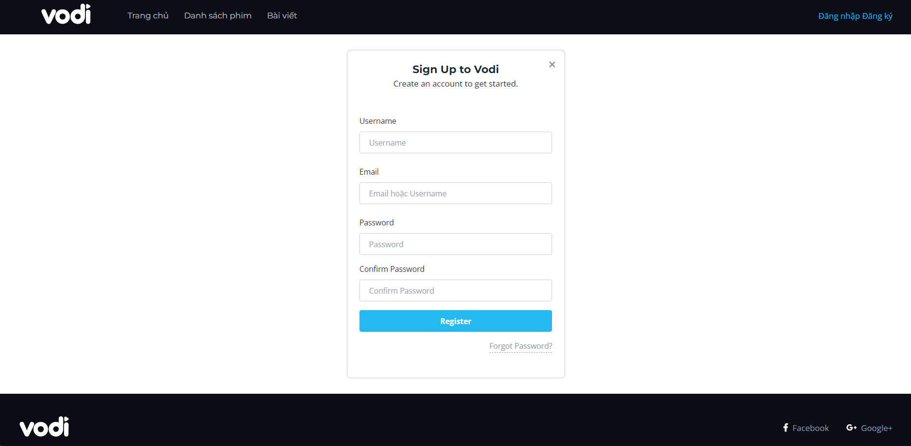
<h4 align="center">Đăng Ký</h4>

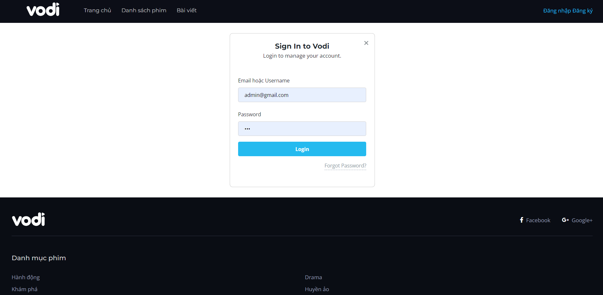
<h4 align="center">Đăng nhập</h4>

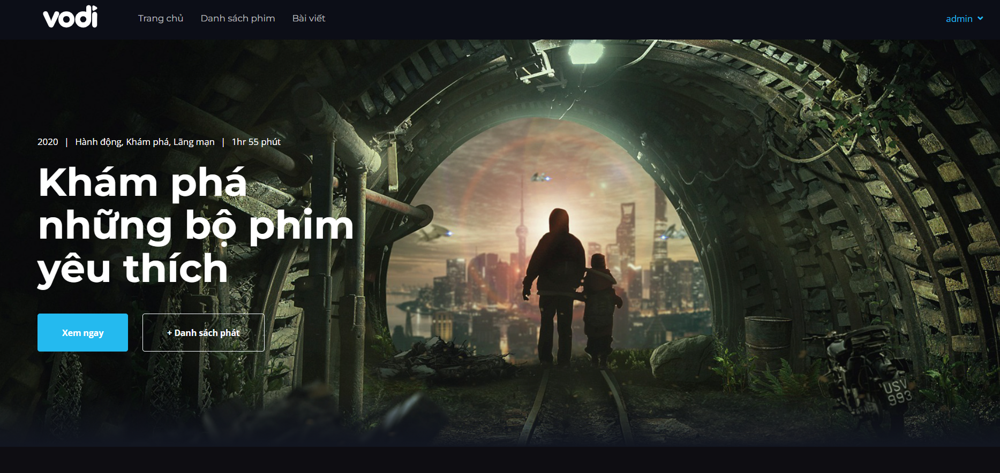
<h4 align="center">Trang Chủ</h4>

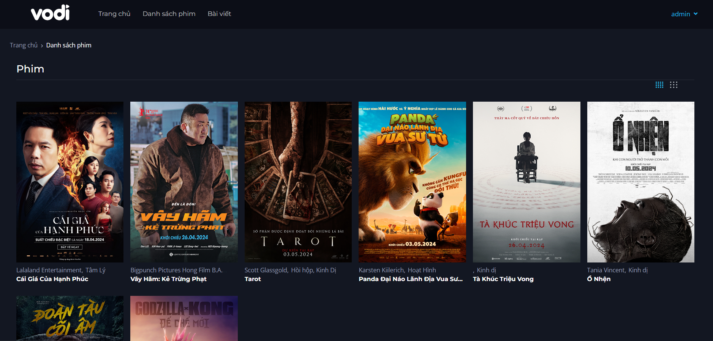
<h4 align="center">Danh sách phim</h4>

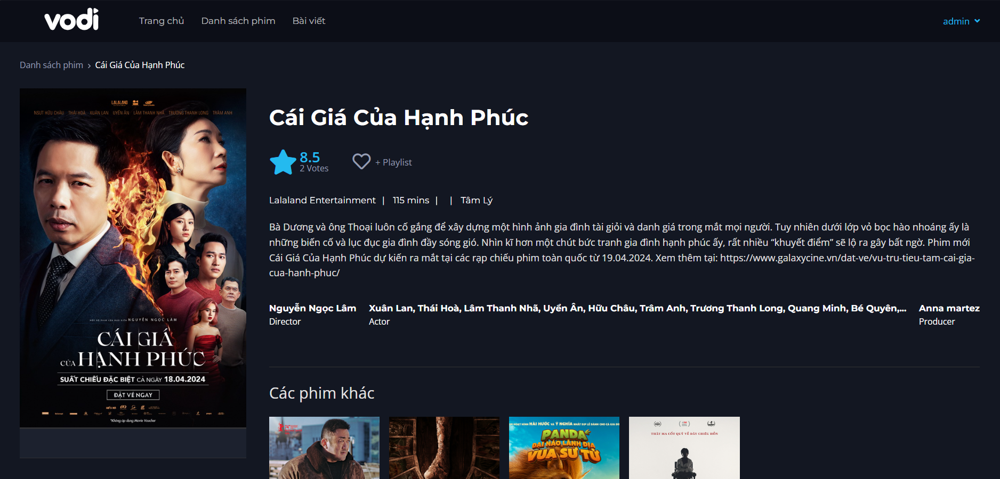
<h4 align="center">Thông tin chi tiết phim</h4>

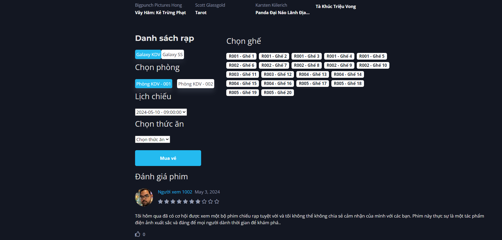
<h4 align="center">Đặt vé</h4>


<h4 align="center">Tin tức</h4>

### Giao diện quản trị

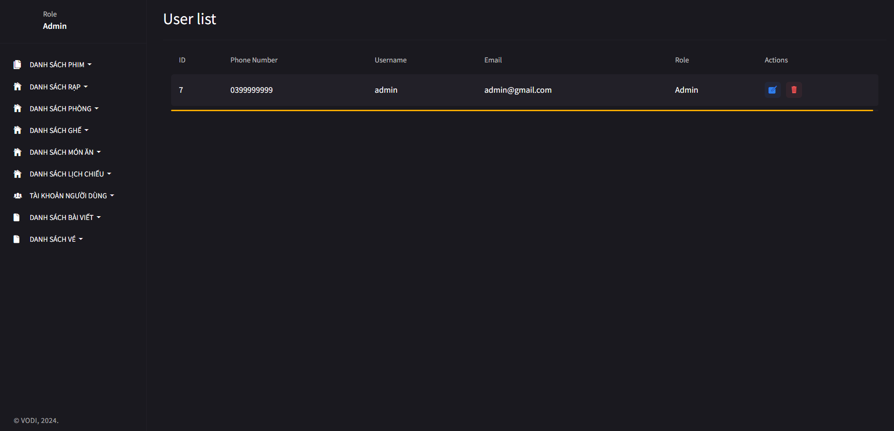
<h4 align="center">Quản lý người dùng</h4>

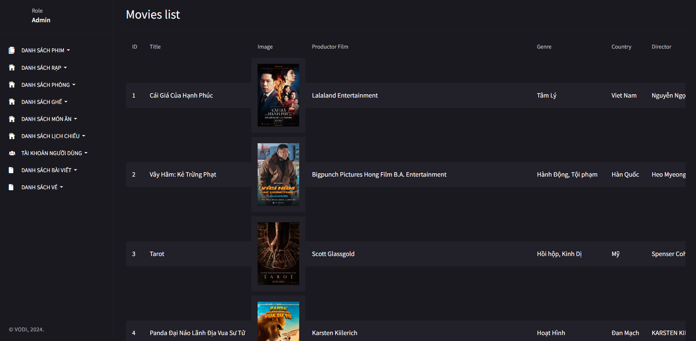
<h4 align="center">Quản lý phim</h4>

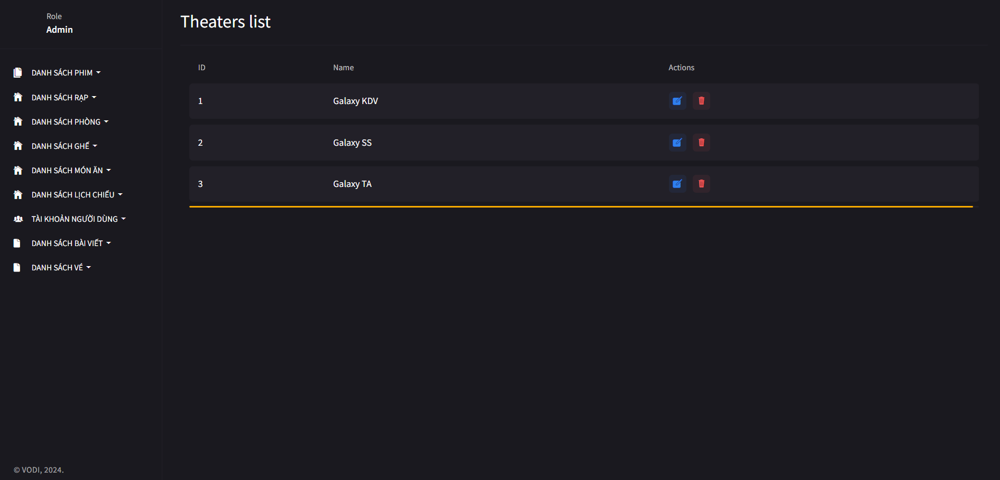
<h4 align="center">Quản lý rạp</h4>

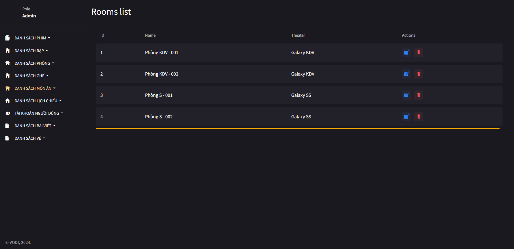
<h4 align="center">Quản lý phòng</h4>

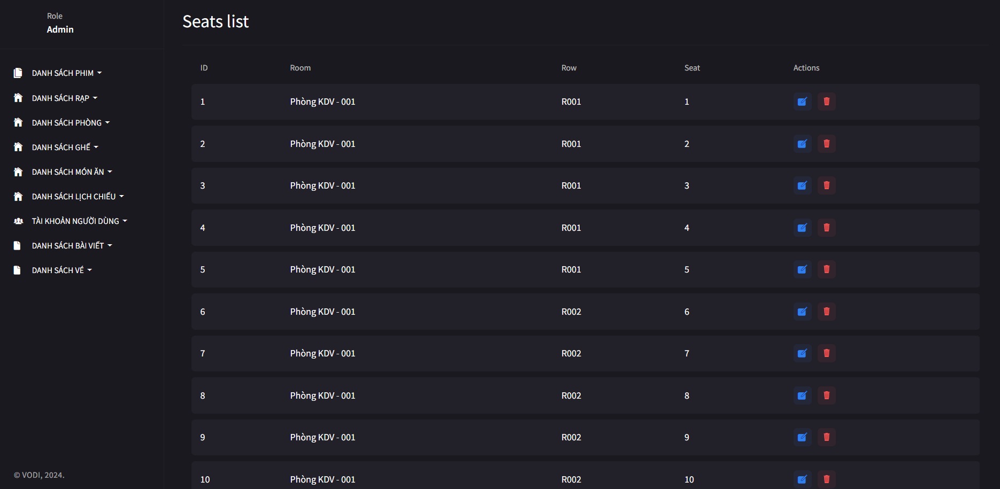
<h4 align="center">Quản lý ghế ngồi</h4>

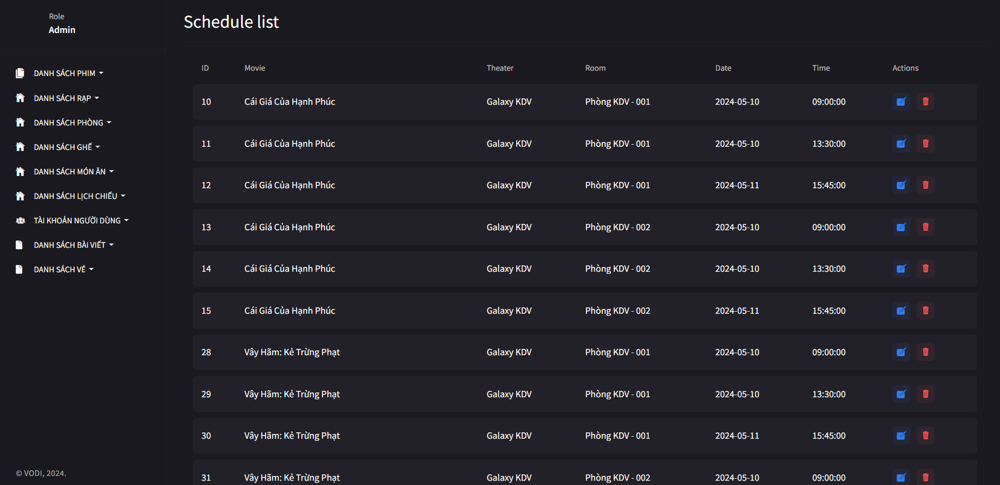
<h4 align="center">Quản lý lịch chiếu</h4>

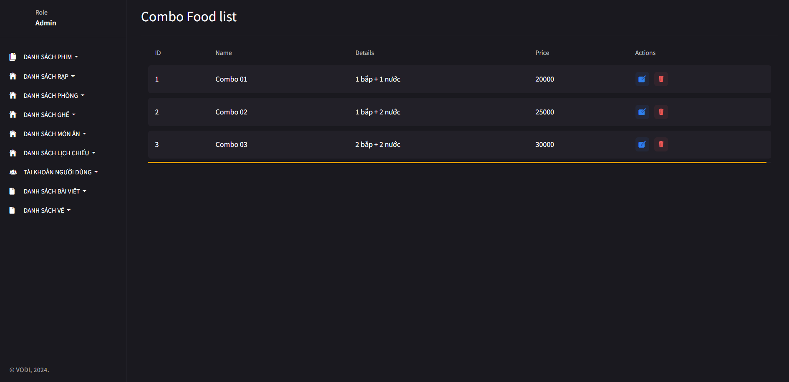
<h4 align="center">Quản lý đồ ăn thức uống</h4>

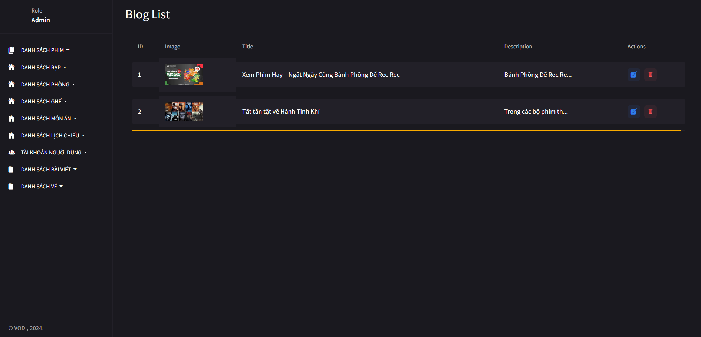
<h4 align="center">Quản lý tin tức</h4>

# Hướng dẫn cài đặt và chạy dự án 

1. **Phiên bản PHP:** 8.2.4
2. **Phiên bản Composer:** 2.7.4

## Bước 1: Tải mã nguồn và giải nén

1. Tải mã nguồn của dự án từ link cung cấp.
2. Giải nén mã nguồn vào thư mục mong muốn.

## Bước 2: Tạo cơ sở dữ liệu

1. Tạo một cơ sở dữ liệu mới tên là `cinema_database`.
2. Import file `.sql` từ thư mục `database/cinema_database.sql` vào cơ sở dữ liệu vừa tạo.

## Bước 3: Cấu hình cơ sở dữ liệu

1. Mở file `.env` trong thư mục gốc của dự án.
2. Cập nhật các thông số cấu hình cho cơ sở dữ liệu như sau:
    ```env
    DB_CONNECTION=mysql
    DB_HOST=127.0.0.1
    DB_PORT=3306
    DB_DATABASE=cinema_database
    DB_USERNAME=<tên-người-dùng>
    DB_PASSWORD=<mật-khẩu>
    ```

## Bước 4: Cài đặt Dependency

1. Mở terminal trong thư mục gốc của dự án.
2. Chạy lệnh sau để cài đặt các gói phụ thuộc:
    ```bash
    composer install
    ```

## Bước 5: Chạy project

1. Mở terminal trong thư mục gốc của dự án.
2. Chạy lệnh sau để khởi động server:
    ```bash
    php artisan serve
    ```
    Bạn sẽ nhận được địa chỉ để truy cập:  
    ```
    Server running on [http://127.0.0.1:8000].
    ```

## Đường dẫn truy cập

- **Trang chủ**: [http://127.0.0.1:8000](http://127.0.0.1:8000)
- **Trang quản trị**: [http://127.0.0.1:8000/dashboard](http://127.0.0.1:8000/dashboard)
